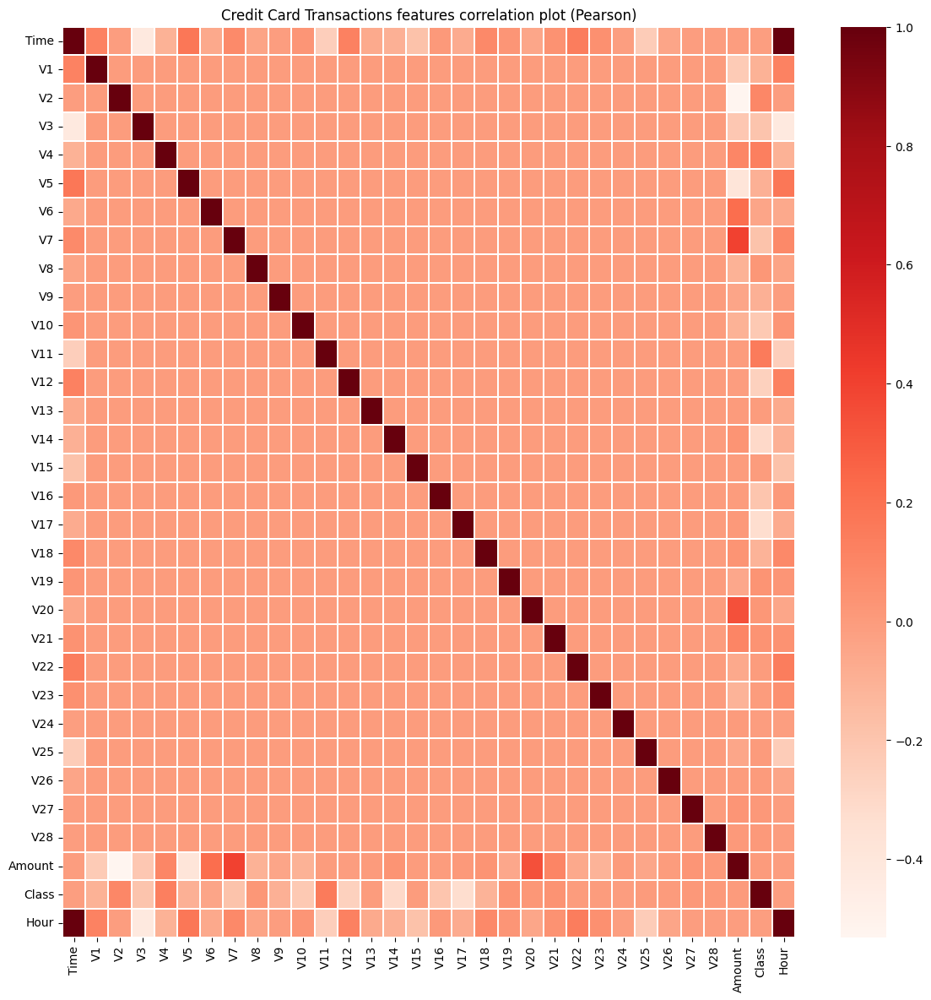
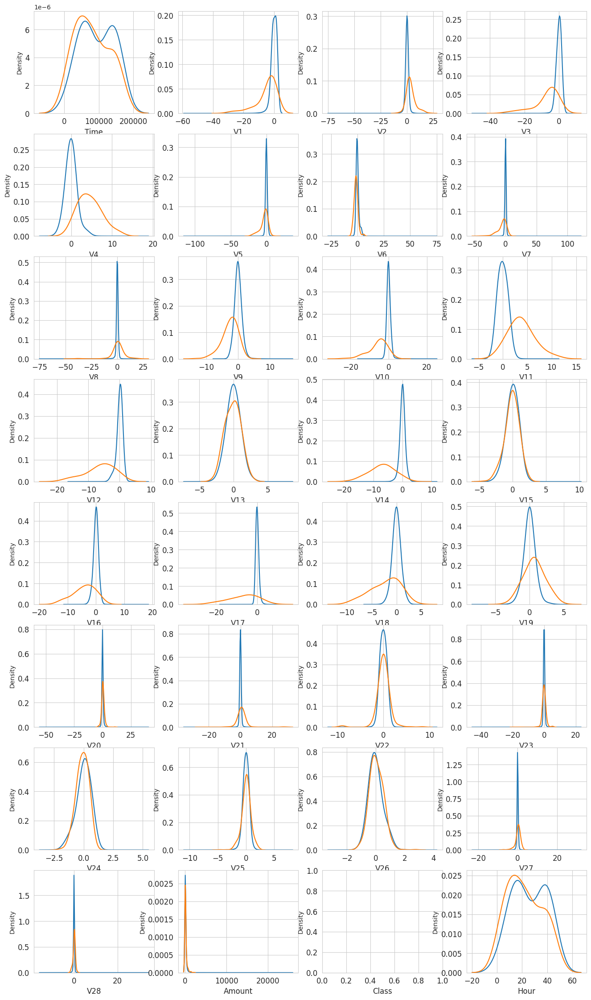
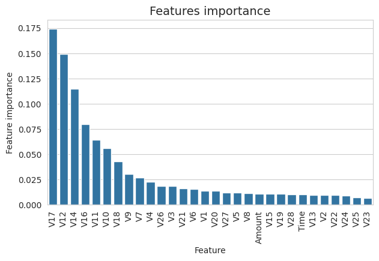
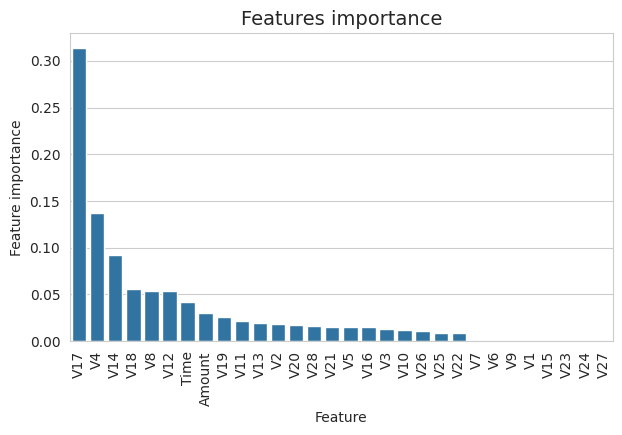

# Credt card fraud detection
The Repository is about analysing the credit card data available on kaggle, and train the model to predict the credit card fraud 

# Visual Insights

### 1. Correlation matrix

### 2. Feature density plot

### 3. Feature importance by Random forest

### 4. Feature importance by AdaBoost Classifier

- Dataset: [creditcard.csv](https://www.kaggle.com/code/gpreda/credit-card-fraud-detection-predictive-models/input)
